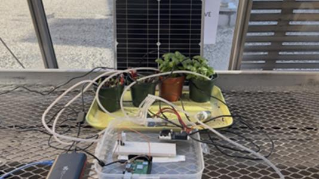
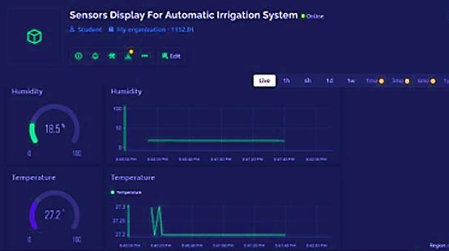
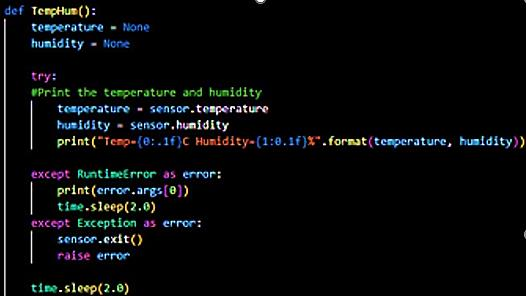

# Solar-Powered Smart Irrigation System with Real-Time Data Monitoring

**Published undergraduate research** · UCNJ Union College of Union County, NJ — *Undergraduate
Research Journal*, Volume 7, No. 1 (Fall 2024), pp. 34–37 · Funded by **National Science
Foundation IRAP grant 1832425** (Infusing Research as Pedagogy)

A fully automated plant and crop watering system that runs entirely on solar power, decides when
to water from live soil-moisture readings, and streams temperature and humidity to a real-time
dashboard. Built and tested end to end — hardware, wiring, control code, power system, and data
pipeline — by a four-person student research team.

📄 **[Read the published paper (PDF)](docs/paper/solar-powered-smart-irrigation-ucnj-urj-vol7-no1.pdf)** ·
🔧 **[Full system and component breakdown](docs/system-and-components.md)**

---

## The system

*The complete rig: 20 W solar panel, 20,000 mAh battery, Arduino with the Smart Pump Shield and
pump in the enclosure, water distributed through a five-way pipe to four planted pots, and the
Raspberry Pi aggregating sensor data. Figure 2 from the paper.*

## The problem we set out to solve

Irrigation is one of the most water- and labor-intensive parts of agriculture, and most of it is
still done by hand. Published estimates put irrigation efficiency at around 35% (Brown, 2020),
which means a large share of the water applied never benefits the crop. Manual watering also
scales badly: it costs labor, it happens on a person's schedule rather than the plant's, and it
fails outright when someone forgets.

We built a system that removes the human from the loop for small-scale irrigation, and does it
without needing grid power — so it works in remote or off-grid locations where the need is often
greatest.

## How it works

**The watering loop.** A capacitive soil-moisture sensor array reads each pot. An Arduino
microcontroller compares those readings against a moisture threshold programmed for the
plant, and when a pot drops below its threshold the Arduino drives the pump through a Smart Pump
Shield, routing water through a five-way pipe and a DC 12 V four-way valve to that pot. The pump
switches off automatically once the target moisture level is reached, so the system delivers what
the soil actually needs instead of a fixed dose. A real-time clock lets watering be scheduled for
optimal periods of the day rather than run at arbitrary times.

**The data path.** A Raspberry Pi handles aggregation and visualization. A DHT22/AM2302 digital
temperature and humidity module feeds environmental data to the Pi over a 4-pin interface, and the
Pi publishes it to a live dashboard, so the growing conditions can be monitored and analyzed
remotely while the system runs unattended.

**The power system.** A 20 W solar panel powers the system during the day and charges a
20,000 mAh battery that carries it through the night. No external power source is required at
any point, which is what makes the design deployable off-grid.

Component-by-component detail, including the full parts list and the data flow, is in
[docs/system-and-components.md](docs/system-and-components.md).

## Real-time monitoring

*The monitoring dashboard: live humidity and temperature gauges with time-series history, so
conditions can be tracked remotely and correlated with watering events. Figure 3 from the paper.*

*Sensor acquisition code on the Raspberry Pi. Beyond the happy path, it handles the transient
read failures that DHT22 sensors routinely throw and exits the sensor cleanly on a hard error —
the difference between a demo and something that stays up. Figure 1 from the paper.*

## Results

- **The automation worked.** The system watered on soil-moisture feedback alone, activating the
  pump below threshold and shutting it off at target, with no human intervention — including
  through conditions where human negligence would otherwise have cost water or plants.
- **Continuous off-grid operation.** Solar during the day, battery at night, no grid connection.
- **Real-time monitoring proved its worth.** Live environmental data made it possible to respond
  to changing conditions rather than discover problems after the fact.
- **Consistent, timely watering.** Removing both the human schedule and human error from watering
  is what drives the water savings and the yield benefit the literature reports for automated
  irrigation — the Automated Alternate Wetting and Drying approach, for example, has been measured
  at a 20% improvement in water use efficiency (Rana et al., 2023).
- **Built from inexpensive, accessible parts,** and operable with little technical background,
  which is the constraint that decides whether small farms can actually adopt it.

## Limitations and future work

Stated plainly in the paper, because they are the honest boundary of a first build:

- Scalability and adaptability across different agricultural environments and crop types remain
  open — this was a controlled small-scale experiment, not a field deployment.
- No controlled water-consumption comparison was run. The clear next step is smart system vs.
  manual control, measured, to quantify the savings rather than infer them.
- Energy efficiency was not characterized and is worth testing directly.
- Modular, customizable components that drop into an existing irrigation framework would make
  adoption realistic.
- Richer sensing — drones, satellite imagery, additional sensor types — would sharpen targeting,
  and a socio-economic study in an actual farming community would test whether the thing helps
  the people it is built for.

## My role

I am one of four student researchers on this project and a co-author of the published paper. The
work ran under an NSF IRAP grant, mentored by Academic Specialist Nabil Kabakibi in the STEM
Division at UCNJ, and covered the whole build: assembling the mechanical and fluid system,
wiring the sensors and pump, programming the Arduino control logic and the Raspberry Pi data
acquisition, integrating the solar power system, testing the rig, and writing it up for
publication.

<!--
  Bruce: replace the paragraph above with the subsystems you personally owned — recruiters ask
  this in the first two minutes. Which parts did you build, which code did you write, what did
  you debug? Keep the team credit, but make your slice explicit.
-->

**Team:** Roger Fortunato, Steven Herrera, Bruce Moseti, Kevin Noriega
**Mentor:** Academic Specialist Nabil Kabakibi, STEM Division, UCNJ Union College of Union County, NJ
**Funding:** National Science Foundation, IRAP grant 1832425

## What this project demonstrates

| Area | Specifics |
| --- | --- |
| Embedded systems | Arduino microcontroller programming, threshold-based control logic, real-time clock scheduling, pump driver shield |
| Sensors and instrumentation | Capacitive soil-moisture sensor array, DHT22/AM2302 temperature and humidity module, sensor calibration and thresholding |
| Linux and Python | Raspberry Pi data aggregation, sensor acquisition in Python with real error handling, live dashboard visualization |
| Electrical and power | 20 W solar panel and 20,000 mAh battery system, DC 12 V valve control, wiring and connectorization for outdoor operation |
| Fluid systems | Pump selection and control, five-way distribution manifold, four-way valve, tubing routing to four independent pots |
| Systems integration | Making sensing, control, actuation, power, and monitoring work as one unattended system rather than five demos |
| Research and communication | Literature review, experimental setup, results analysis, and a peer-reviewed journal publication |

## Reference

Fortunato, R., Herrera, S., Moseti, B., & Noriega, K. (2024). Development of a Solar-Powered
Smart Irrigation System with Real-Time Data Monitoring. *UCNJ Union College of Union County, NJ
Undergraduate Research Journal, 7*(1), 34–37.
[Local copy](docs/paper/solar-powered-smart-irrigation-ucnj-urj-vol7-no1.pdf)

Contact for the project as published: bruce.moseti@owl.ucc.edu
